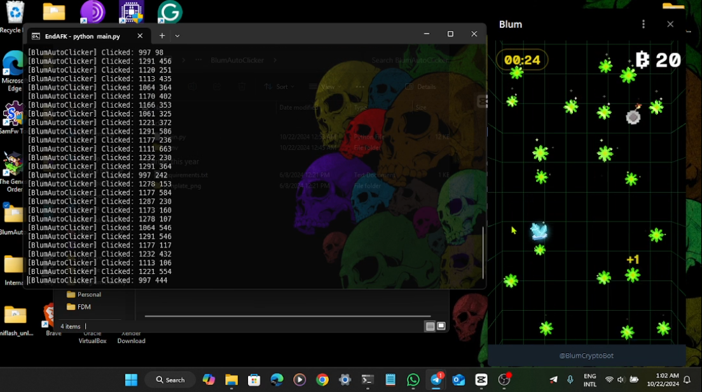

# Blum-Autoclicker
This repository contains scripts designed to automate playing the Blum minigame on Telegram. Each script version has specific functionalities.

## Versions
- **Normal Game Script**: Automates normal gameplay.(Windows)
- **Event Script**: Tailored for themed elements, such as Halloween pumpkins.(Windows)
- **Linux Compatibility Script**: Linux-compatible version of the normal game script.

## Running the Script
  **Open Telegram and start the minigame.**
  **Run this script in your terminal**
       python3 FILENAME.py
  **The bot will automatically search for the specified color targets within the Telegram window.**

# Disclaimer: I am not responsible for suspended accounts!
